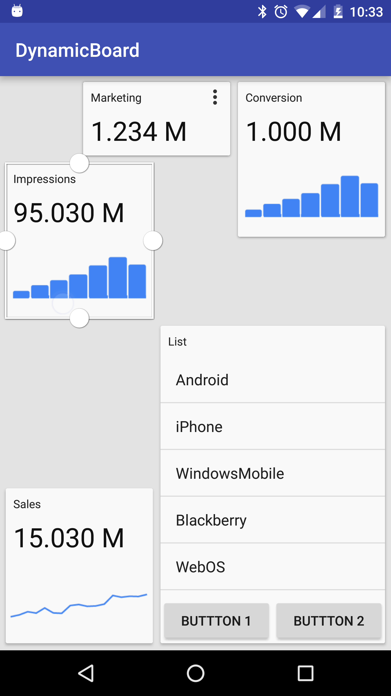

# DynamicBoard (0.6)

It's a simple library which mimics the behavior of the App Widgets in the Android's home screen.

### See it in action

[](http://www.youtube.com/watch?v=oZh10REIljY "Example app of the Dynamic Board library")

### Example application

[Download the apk file from here](dynamicBoardExample-0.6.apk "APK 0.6")

### Screens




### Options

The items are:
- rearangeable (no overlap),
- resizable (with definable min and max sizes),

### Usage

Create a board item with extension of the BoardItem class. You have to define two View. One for the View actual item, 
and one for the background. The background view is only visible during the drag event.
You also get two callback for resize and move events, where you can do your stuff.

```java
public class ExampleBoardItem extends BoardItem {
    @Override
    public ViewGroup getView(GridPosition position, Size size) {
        //Return the actual view.
    }

    @Override
    public View getPlaceholderView(GridPosition position, Size size) {
        //Return with the placeholder for the move
    }

    @Override
    public void onViewResized(Size oldSize, Size newSize) {

    }

    @Override
    public void onViewMoved(GridPosition oldPosition, GridPosition newPosition) {

    }
}
```

Once you done it you just have to add a DynamicBoardLayout whenever you want to use it:

```xml
    <hu.gabornovak.dynamicboard.DynamicBoardLayout
        android:id="@+id/board"
        android:layout_width="match_parent"
        android:layout_height="match_parent"/>
```

The last thing you have to do is add BoardItems to the board when it's ready:

```java
 boardLayout = (DynamicBoardLayout) findViewById(R.id.board);

        boardLayout.setOnBoardInitializedListener(new Board.OnBoardInitializedListener() {
            @Override
            public void onBoardInitialized(Size boardSize) {
                BoardItem boardItem1 = new ExampleBoardItem();
                BoardItem boardItem2 = new ExampleBoardItem();
           
                boardItem1.setMinSize(new Size(2, 1));
                boardItem2.setMinSize(new Size(2, 2));

                boardLayout.addBoardItem(boardItem1, new GridPosition(0, 0), new Size(2, 2));
                boardLayout.addBoardItem(boardItem2, new GridPosition(2, 0), new Size(3, 3));

                System.out.println("Board size: " + boardSize);
            }
        });
```

That's it, you ready to go.

Please note that this is project is not quite done yet. If you have any questions please
don't hesitate to ask me! gabor.novak.88@gmail.com
